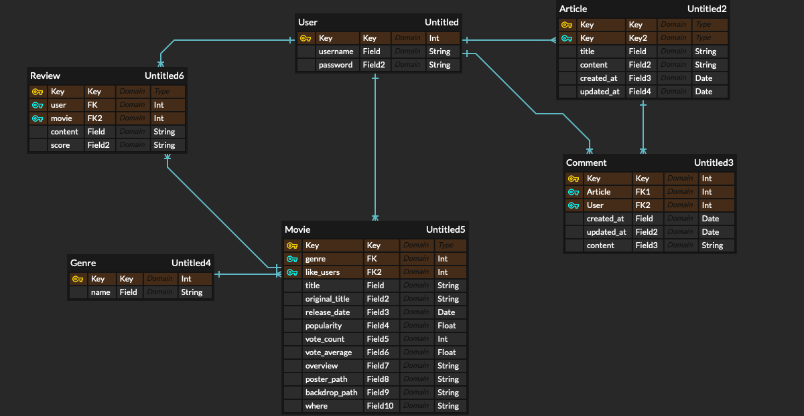
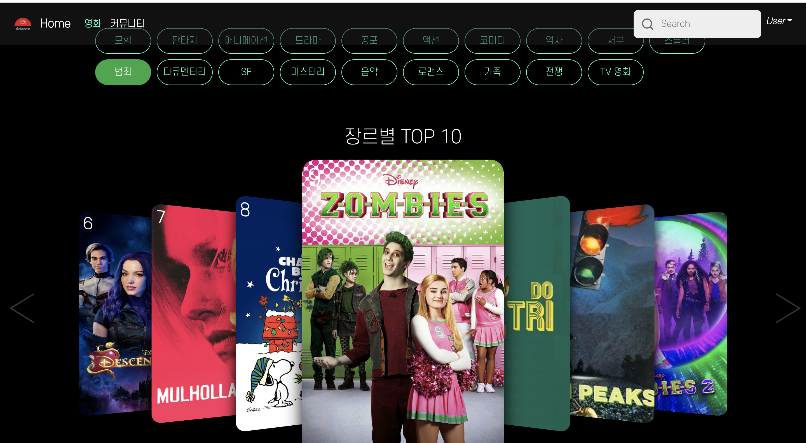
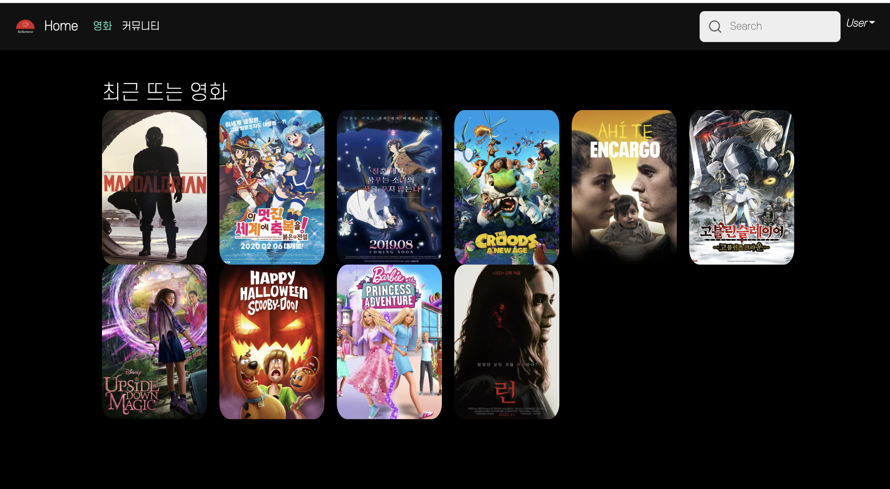
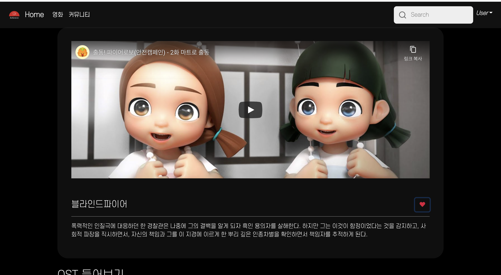
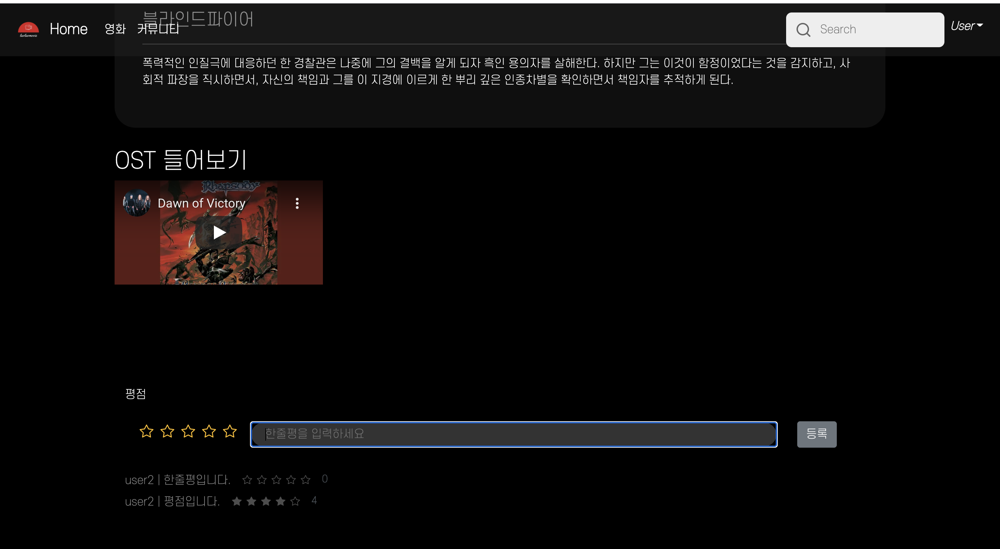
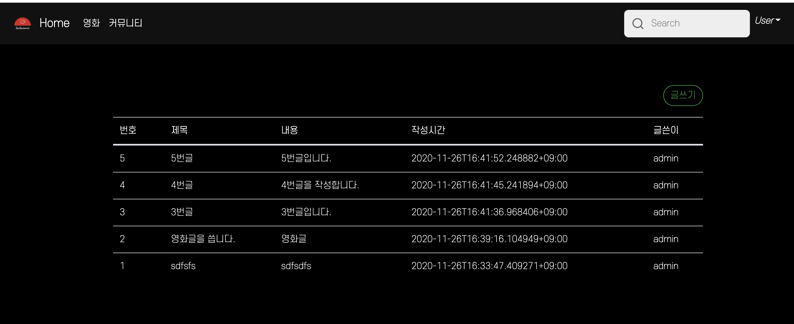
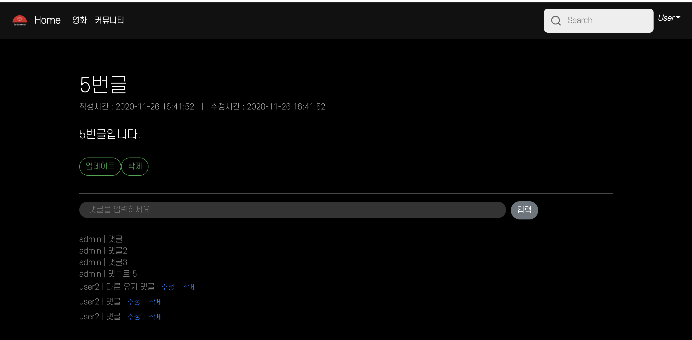
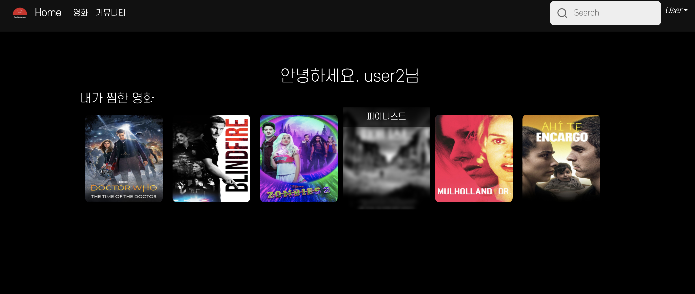

# 👭LuvLuvMovie👬

> 내가 좋아하는 장르를 기반으로 영화를 추천해주는 커 [fianl-pjt-readme.md](fianl-pjt-readme.md) 뮤니티 애플리케이션

📒 협업 규칙
커밋시 팀원에게 알릴 것
삽질은 나만!, 삽질 또는 공부중 발견한 Insight, Reference는 트렐로를 통해 공유

## i. 팀원 정보 및 업무 분담 내역

- 길아현
  - gitlab 주소 : 
    - https://lab.ssafy.com/ahyeoncode/final-pjt-back
    - https://lab.ssafy.com/ahyeoncode/final-pjt-front
  - 서버(django) 개발
    - 영화 API, 유저 API 개발
  - 프론트(vue) 개발
    - MovieHome 화면 개발, 및 스타일링
  - API 크롤링
- 염성훈
  - gitlab 주소 :
  - 서버(django) 개발
    - 게시판 API 개발
  -  프론트(vue) 개발
    - MovieDetail 화면, 게시판 화면, 유저 화면 개발

## ii.목표 서비스 구현 및 실제 구현정도

- 목표 서비스
  - 사용자가 상세 영화 항목을 좋아요하면 해당 영화의 장르를 카운트하고 가장 높은 갯수를 가진 장르 중 상위 평점을 
  - TMDB API를 활용하여 최근 상영중인 영화와 인기영화 추천
  - 영화 상세페이지에서 YOUTUBE API를 활용하여 예고편과 해당 영화의 OST를 표기
  - 영화 뿐만 아니라 자유롭게 사용할 수 있는 게시판 CRUD 및 댓글 CRUD 구현
  - 사용자가 좋아요한 영화를 마이페이지 목록에서 구현

## iii 데이터베이스 모델링(ERD)



## iV 필수 기능에 대한 설명 

1) 영화 상세 정보를 좋아요하면  해당 영화의 장르를 서버로 보내고 좋아요한 장르의 수를 카운트해서 가장 높은 갯수를 가진 장르를 사용자에게 추천해준다.


2) TMDB API를 활용하여 전문가 평점을 기반으로 인기영황와 현재 상영영화 추천 

- movies/view.py

```python
@api_view(['GET'])
def movie_list(request, genre_pk):
    # print(genre_pk)
    movies = Movie.objects.all().filter(genres__id__icontains=genre_pk).order_by('-vote_average')[:10]
    serializer = MovieListSerializer(movies, many=True)
    # print('clear')
    return Response(serializer.data)
  
@api_view(['GET'])
def movie_category(request, where):
    movies = Movie.objects.all().filter(where=where).order_by('-vote_average')[:10]
    serializer = MovieBackdropSerializer(movies, many=True)
    # print(serializer.data)
    return Response(serializer.data)
```

where에는 인기영화 카테고리가 들어가고 `vote_average`를 기준으로 상위 10개의 영화 정보를 가져와서 사용자에게 출력해준다.

- 실행화면

> 디자인은 carousel을 활용했고 TMDB API에 접근하여 장르에 해당하는 평점을 검색하여 상위 10개를 client화면에 띄워 줬습니다. 



>   화면에서는 최근 뜨는 영화(인기영화)로 지정되어 있다.



3) 영화 상세페이지에서 YOUTBUE API를 활용하여 예고편과 OST표기 (유투브 영상으로)

- MovieTrailer.vue

```vue
export default {  
    name : "MovieMusic",
    data() {
        return {
            inputText : '',
            videoId : ''
        }
    }, 
    methods : {
        getMovieOST: function () {
    
            const params = {
            key: YOUTUBE_API_KEY,
            part: 'snippet',
            type: 'video',
            q: this.inputText,
            }
            axios.get(YOUTUBE_API_URL, {
                params,
            })
            .then((res) => {
            this.videoId = res.data.items[0].id.videoId
            })
            .catch((err) => {
                console.log(err)
            })
        },
    },
```

YOUTUBE API를 활용하여 정보를 받아왔으며 서버에 형식대로 맞춰서 보내주기 위해 params를 활용해서 서버에 요청을 보내 비디오 정보를 받아와 inputText에 영화명 + OST, 예고편으로 검색해 해당 비디오를 영화 상세페이지에 띄워 줬다.

- 실행화면





4)게시판 CRUD구현

-  articles/models.py

```python
class Article(models.Model):
    title = models.CharField(max_length=100)
    content = models.TextField()
    created_at = models.DateTimeField(auto_now_add=True)
    updated_at = models.DateTimeField(auto_now=True)
    user = models.ForeignKey(settings.AUTH_USER_MODEL, on_delete=models.CASCADE, related_name="articles")

class Comment(models.Model):
    content = models.TextField()
    created_at = models.DateTimeField(auto_now_add=True)
    updated_at = models.DateTimeField(auto_now=True)
    article = models.ForeignKey(Article, on_delete=models.CASCADE)
    user = models.ForeignKey(settings.AUTH_USER_MODEL, on_delete=models.CASCADE, related_name="comments")
```

게시판과 댓글은 유저와 1:N관계로 설정했고 게시판 진입은 로그인을 하지않을 시 접근하지 못하게 했습니다. 댓글또한 마찬가지로 유저에따라 수정 삭제가 가능하도록 하였습니다.

- 실행화면

> 전체 게시판



> 상세 페이지




5) 사용자가 좋아요한 영화를 마이페이지 목록에서 구현

- movies/views.py

```python
@api_view(['GET','POST'])
@authentication_classes([JSONWebTokenAuthentication])
@permission_classes([IsAuthenticated])
def like(request, movie_pk):
    movie = get_object_or_404(Movie, pk=movie_pk)
    if request.method == 'GET':
        if movie.like_users.filter(pk=request.user.pk).exists():
            return Response(True)
        else:
            return Response(False)
    else:
        if movie.like_users.filter(pk=request.user.pk).exists():
            # 좋아요 취소
            movie.like_users.remove(request.user)
            return Response({'like': False})
        else:
            # 좋아요
            movie.like_users.add(request.user)
            return Response({'like': True})

# 내가 좋아요한 영화들
@api_view(['GET'])
@authentication_classes([JSONWebTokenAuthentication])
@permission_classes([IsAuthenticated])
def my_movie(request):
    movies = request.user.like_movies
    # movies = Movie.objects.all()
    print(request.method)
    serializer = MovieListSerializer(movies, many=True)
    return Response(serializer.data)

```

- movies/models.py

```python
class Movie(models.Model):
    title = models.CharField(max_length=200)
    original_title = models.CharField(max_length=200)
    release_date = models.DateField()
    popularity = models.FloatField()
    vote_count = models.IntegerField()
    vote_average = models.FloatField()
    overview = models.TextField()
    poster_path = models.CharField(max_length=500)
    backdrop_path = models.CharField(max_length=500)
    genres = models.ManyToManyField(Genre, related_name='movies')
    where = models.CharField(max_length=200)
    like_users = models.ManyToManyField(settings.AUTH_USER_MODEL, related_name='like_movies')
```

- movies/serializers.py

```python
class MovieListSerializer(serializers.ModelSerializer):
    class Meta:
        model = Movie
        fields = ('id', 'title', 'poster_path',)
```

한명의 유저가 여러개의 상세 영화 항목을 좋아요 할 수 있고 한개의 상세 영화 항목이 여러명의 유저를 좋아요할 수 있다. 따라서 django의 ManyToManyField를 사용해서 중계모델 없이 model.py를 구성했다. ManyToManyField를 사용하면 자동으로 중계테이블이 형성되고 이를 serializer를 통해서 Movie모델의 원하는 필드 값만 반환시켰다. 이부분을 구현하는데 어려움을 겪었다.

- 실행화면 


> 좋아요한 영화 목록을 목록에 담았고 마우스를 올리면 해당 영화의 제목이 상단에 출력될 수 있게 했다. 클릭하면 해당 영화의 상세페이지로이동한다. 



## V.배포 URL

- django URL : https://quiet-bastion-95503.herokuapp.com/movies/genres/
- netflify : https://relaxed-borg-6250c9.netlify.app/movies


## Vi. 느낀점

- DRF에서 url설정의 중요성을 느낄 수 있었는데 마지막에 좋아요 기능을 전부 만들고 스타일링까지 한 상태에서 git을 통해서 서로의 작업부분을 merge했는데 마이페이지 좋아요 부분이 제대로 작동하지 않았다. 이유는 url을 Restful하게 작성하지 않아서 인데 같은 변수명이 다르더라도 같은 레벨에 베리어블라우팅을 지정하면 겹쳐서 해당 url로 함수가 넘어가지 않았다. 결국 교수님께서 알려주셔서 문제를 해결했다. 다음부터는 DRF를 사용할때 변수명의 레벨을 나눠서 지정해줘야 겠다고 느꼇다.
- 처음에는 잘 느끼지 못했는데 모델을 어떤 식으로 구성할지 명확하게 정하고 가야 한다는 것을 느꼈는데 모델이 바뀌면 field값들이 바뀌고 현재 사용되는 로직이 전부 변경되서 수정하는데 꽤나 시간이 걸렸다. 그래서 처음에 모델에 어떤 필드를 넣어야하고 1:N, N,M관계는 어떤식으로 선정해야할지 먼저 정하고 시작하는게 좋을것 같다.